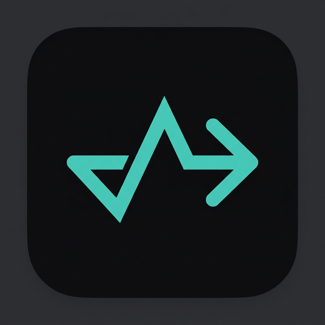

# Stride — Habit & Task Tracker

A personal habit tracker + shared task board with real-time sync, streaks, progress charts, and a calm dark-mode interface. Built as a Progressive Web App (PWA) with Firebase Firestore for two-user collaboration.



---

## ✨ Features

### 🔒 Habits (Private)
- **Custom habits** across 4 categories: Health & Fitness, Learning & Skills, Work & Productivity, Mental Wellness
- **Flexible scheduling**: daily, weekly, custom days, or one-time
- **Streaks**: consecutive completion tracking displayed per habit
- **Priority flags**: high, medium, or low with visual color indicators
- **Deadlines & reminders**: optional date deadlines and daily browser notification reminders
- **Per-entry notes**: journaling/notes field for each habit each day
- **Daily navigation**: browse your habits for any date

### 📋 Tasks (Shared)
- **Shared task board** synced in real-time between Owner and Assistant via Firebase Firestore
- **Priority sorting**: tasks auto-sort High → Medium → Low, then by deadline
- **Status workflow**: To Do → In Progress → Done (dropdown selector)
- **Filter chips**: view tasks by status (All, To Do, In Progress, Done)
- **Assignment**: assign tasks to Owner, Assistant, or Both
- **Deadlines & reminders**: same as habits

### 📊 Stats
- 30-day completion rate (line chart)
- Per-habit breakdown (horizontal bar chart)
- Overview cards: completion rate, best streak, done today, total habits

### 👥 Two-User Sync
- **Owner** sees Habits + Tasks + Stats
- **Assistant** sees Tasks + Stats only (habits are private)
- Tasks sync in real-time via Firestore — changes appear instantly on both devices
- Offline-first: works without internet, syncs when reconnected

### 📱 Progressive Web App
- Installable on mobile and desktop
- Works offline via service worker
- Dark theme optimized for OLED screens

---

## 🚀 Getting Started

### 1. Clone the repo
```bash
git clone https://github.com/VictorZhayon/stride-habit-tracker.git
cd stride-habit-tracker
```

### 2. Set up Firebase (for sync)
1. Create a project at [Firebase Console](https://console.firebase.google.com)
2. Go to **Firestore Database** → **Create database** → pick your region → **Start in test mode**
3. Go to the **Rules** tab and paste:
```
rules_version = '2';
service cloud.firestore {
  match /databases/{database}/documents {
    match /tasks/{taskId} {
      allow read, write: if true;
    }
    match /{document=**} {
      allow read, write: if false;
    }
  }
}
```
4. Click **Publish**

### 3. Deploy
Since Stride is purely static (HTML/CSS/JS), you can host it anywhere:
- **GitHub Pages**: push and enable in repo Settings
- **Netlify / Vercel**: drag-and-drop the folder or connect the repo
- **Firebase Hosting**: `firebase init hosting` → `firebase deploy`
- Any static file host

### 4. Open the app
- On first launch, select your role: **Owner** (you) or **Assistant** (your VA)
- The sync indicator in the header turns 🟢 when connected to Firebase

---

## 📁 Project Structure

```
habit-tracker/
├── index.html          # App shell — setup screen, views, modals
├── style.css           # Full design system — dark mode, responsive
├── app.js              # Core logic — habits, tasks, charts, reminders
├── firebase-sync.js    # TaskSync class — Firestore CRUD + real-time listener
├── sw.js               # Service worker — offline caching
├── manifest.json       # PWA manifest
└── icon-512.png        # App icon
```

---

## 🛠 Tech Stack

| Layer | Technology |
|-------|-----------|
| **Frontend** | Vanilla HTML, CSS, JavaScript (no frameworks) |
| **Charts** | [Chart.js](https://www.chartjs.org/) v4.x (CDN) |
| **Sync** | [Firebase Firestore](https://firebase.google.com/docs/firestore) (compat SDK, CDN) |
| **Storage** | localStorage (habits), Firestore (tasks) |
| **PWA** | Web App Manifest + Service Worker |

---

## 📄 License

MIT
